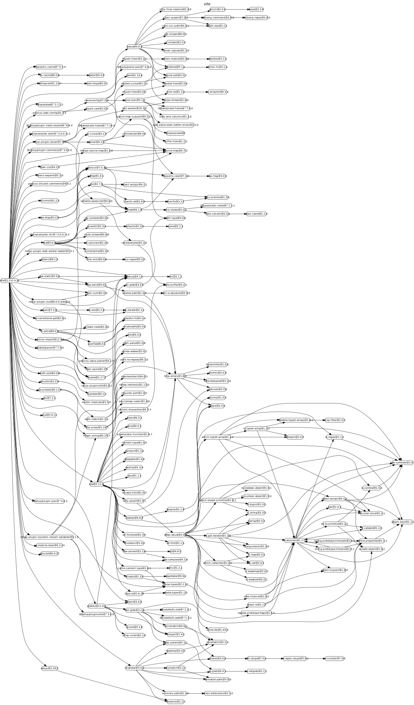
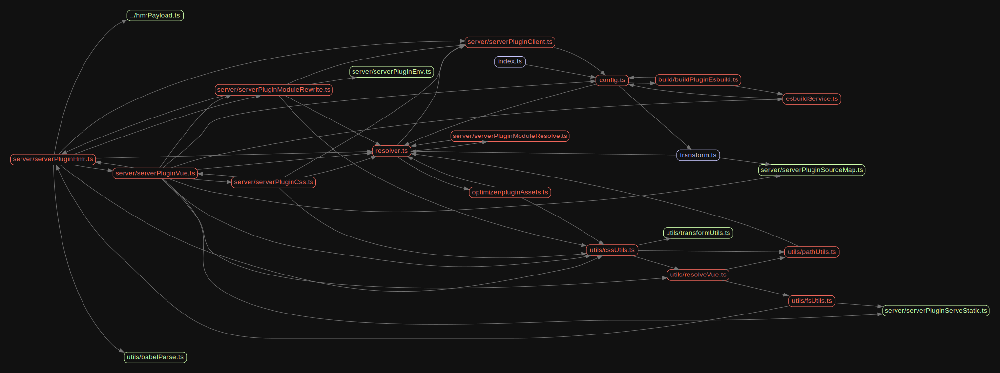

# 源码分析

## 文件结构

``` bash
/Users/liufang/openSource/FunnyLiu/vite
├── CHANGELOG.md
├── LICENSE
├── README.md
├── appveyor.yml
├── bin
|  ├── openChrome.applescript
|  └── vite.js
├── importMeta.d.ts
├── jest.config.js
├── package.json
├── playground
|  ├── App.vue
|  ├── TestAsync.vue
|  ├── TestEnv.vue
|  ├── TestPreprocessors.vue
|  ├── TestSyntax.vue
|  ├── alias
|  |  ├── TestAlias.vue
|  |  ├── aliased
|  |  |  └── index.js
|  |  ├── aliased-dir
|  |  |  ├── importOutside.js
|  |  |  ├── index.js
|  |  |  └── named.js
|  |  └── aliased-dir-import.js
|  ├── css
|  |  ├── TestCssModules.vue
|  |  ├── TestPostCss.vue
|  |  ├── TestScopedCss.vue
|  |  ├── empty.css
|  |  ├── testCssModules.module.css
|  |  ├── testPostCss.css
|  |  └── testScssModules.module.scss
|  ├── css-@import
|  |  ├── TestCssAtImport.vue
|  |  ├── TestScssAtImport.vue
|  |  ├── imported.css
|  |  ├── imported.module.css
|  |  ├── testCssAtImportFromScript.css
|  |  ├── testCssAtImportFromStyle.css
|  |  ├── testCssModuleAtImportFromScript.module.css
|  |  ├── testCssModuleAtImportFromStyle.module.css
|  |  ├── testScss.imported.scss
|  |  ├── testScssAtImportFromScript.scss
|  |  └── testScssAtImportFromStyle.scss
|  ├── custom-blocks
|  |  ├── TestCustomBlocks.vue
|  |  ├── i18n.js
|  |  └── i18nTransform.js
|  ├── dynamic-import
|  |  ├── TestDynamicImport.vue
|  |  └── views
|  |     ├── One.vue
|  |     └── Two.vue
|  ├── fonts
|  |  ├── Inter-Italic.woff
|  |  └── Inter-Italic.woff2
|  ├── hmr
|  |  ├── TestHmr.vue
|  |  ├── testHmrManual.js
|  |  ├── testHmrManualDep.js
|  |  ├── testHmrPropagation.js
|  |  ├── testHmrPropagationDynamicImport.js
|  |  ├── testHmrPropagationFullDynamicImport.js
|  |  └── testHmrPropagationFullDynamicImportSelfAccepting.js
|  ├── index.html
|  ├── json
|  |  ├── TestJsonImport.vue
|  |  └── testJsonImport.json
|  ├── jsx
|  |  ├── TestJsx.vue
|  |  ├── testJsx.jsx
|  |  └── testTsx.tsx
|  ├── main.js
|  ├── optimize-linked
|  |  ├── TestOptimizeLink.vue
|  |  ├── index.js
|  |  ├── linked-dep
|  |  |  ├── index.js
|  |  |  ├── other.js
|  |  |  └── package.json
|  |  ├── package.json
|  |  └── yarn.lock
|  ├── package.json
|  ├── plugins
|  |  └── jsPlugin.ts
|  ├── postcss.config.js
|  ├── public
|  |  └── icon.png
|  ├── resolve
|  |  ├── TestModuleResolve.vue
|  |  ├── TestNormalizePublicPath.vue
|  |  ├── browser-field
|  |  |  ├── out
|  |  |  |  ├── cjs.node.js
|  |  |  |  └── esm.browser.js
|  |  |  └── package.json
|  |  ├── rewrite-optimized
|  |  |  ├── TestRewriteOptimized.vue
|  |  |  └── test-package
|  |  |     ├── index.js
|  |  |     ├── package.json
|  |  |     └── util.js
|  |  ├── rewrite-unoptimized
|  |  |  ├── TestRewriteUnoptimized.vue
|  |  |  └── test-package
|  |  |     ├── es
|  |  |     |  ├── index.js
|  |  |     |  └── nested
|  |  |     |     ├── foo.js
|  |  |     |     └── index.js
|  |  |     └── package.json
|  |  └── util
|  |     ├── bar.util.js
|  |     └── index.js
|  ├── script-setup
|  |  └── TestScriptSetupStyleVars.vue
|  ├── src-import
|  |  ├── TestBlockSrcImport.vue
|  |  ├── script.ts
|  |  ├── style.css
|  |  └── template.html
|  ├── test-assets
|  |  ├── TestAssets.vue
|  |  ├── nested
|  |  |  └── testAssets.png
|  |  └── testAssets.css
|  ├── test.html
|  ├── transform
|  |  ├── TestTransform.vue
|  |  ├── testTransform.js
|  |  └── testTransform.scss
|  ├── ts
|  |  ├── TestTs.vue
|  |  └── testTs.ts
|  ├── tsconfig.json
|  ├── vite.config.ts
|  ├── wasm
|  |  ├── TestWasm.vue
|  |  └── simple.wasm
|  ├── worker
|  |  ├── TestWorker.vue
|  |  ├── worker.js
|  |  └── workerImport.js
|  └── yarn.lock
├── scripts
|  ├── patchTypes.js
|  └── verifyCommit.js
├── src
|  ├── client
|  |  ├── client.ts
|  |  ├── env.d.ts
|  |  ├── tsconfig.json
|  |  └── vueJsxCompat.ts
|  ├── hmrPayload.ts
|  └── node
|     ├── build
|     |  ├── buildPluginAsset.ts
|     |  ├── buildPluginCss.ts
|     |  ├── buildPluginEsbuild.ts
|     |  ├── buildPluginHtml.ts
|     |  ├── buildPluginReplace.ts
|     |  ├── buildPluginResolve.ts
|     |  ├── buildPluginWasm.ts
|     |  └── index.ts
|     ├── cli.ts
|     ├── config.ts
|     ├── esbuildService.ts
|     ├── index.ts
|     ├── optimizer
|     |  ├── index.ts
|     |  └── pluginAssets.ts
|     ├── resolver.ts
|     ├── server
|     |  ├── index.ts
|     |  ├── serverPluginAssets.ts
|     |  ├── serverPluginClient.ts
|     |  ├── serverPluginCss.ts
|     |  ├── serverPluginEnv.ts
|     |  ├── serverPluginEsbuild.ts
|     |  ├── serverPluginHmr.ts
|     |  ├── serverPluginHtml.ts
|     |  ├── serverPluginJson.ts
|     |  ├── serverPluginModuleResolve.ts
|     |  ├── serverPluginModuleRewrite.ts
|     |  ├── serverPluginProxy.ts
|     |  ├── serverPluginServeStatic.ts
|     |  ├── serverPluginSourceMap.ts
|     |  ├── serverPluginVue.ts
|     |  ├── serverPluginWasm.ts
|     |  └── serverPluginWebWorker.ts
|     ├── transform.ts
|     ├── tsconfig.json
|     └── utils
|        ├── babelParse.ts
|        ├── createCertificate.ts
|        ├── cssUtils.ts
|        ├── fsUtils.ts
|        ├── index.ts
|        ├── openBrowser.ts
|        ├── pathUtils.ts
|        ├── resolveVue.ts
|        ├── shims.d.ts
|        └── transformUtils.ts
├── tsconfig.base.json
└── yarn.lock

directory: 44 file: 163

ignored: directory (1)

```

## 外部模块依赖



## 内部模块依赖


  